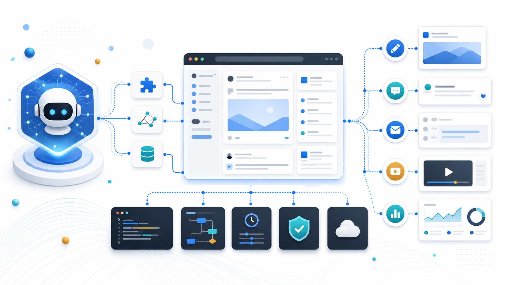
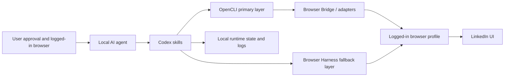

# AI LinkedIn Operator



AI LinkedIn Operator packages a local, compliance-conscious browser operating stack for agents that need to help with LinkedIn publishing and relationship-building workflows.

It is built around Codex skills, OpenCLI, Browser Harness, and the user's own logged-in browser session. The repository does not contain LinkedIn credentials, cookies, browser profiles, private messages, private logs, or account memory.

## What This Repository Enables

After installation in a local agent environment, an agent can follow specialized skills for:

- publishing native LinkedIn video posts
- publishing LinkedIn text posts
- leaving targeted LinkedIn comments
- sending low-risk, individually verified LinkedIn connection requests from vetted prospect lists
- checking whether OpenCLI and Browser Harness share the same logged-in browser state
- keeping OpenCLI and Browser Harness aligned on the same browser profile and active tab
- verifying readiness before any browser write action

This is not a cloud SaaS, not a LinkedIn API client, and not a permission grant to automate a third-party platform. It is a local operating bundle that gives an agent repeatable instructions, wrappers, and checks for working through the user's browser when the user has authorization to do so.

## Can An Agent Operate LinkedIn After Installing This?

Yes, with important conditions.

Installing this repository gives a local Codex-style agent the skills and wrappers needed to operate a browser through OpenCLI and Browser Harness. The user still needs to:

- run the installer on a local Windows/PowerShell environment
- keep their own browser logged in
- complete any browser permission or remote-debugging prompts
- verify the stack with `browser-stack.ps1 doctor` and `browser-stack.ps1 verify-login`
- give explicit approval or standing instructions before write actions
- comply with LinkedIn policies, applicable law, and the user's organization rules

In practice, the repository turns browser automation from an ad-hoc session into a repeatable skill stack. It does not remove the need for human accountability, policy review, or target verification.

## Architecture



The stack follows one rule: use the most deterministic tool first, then fall back only when needed.

OpenCLI is the primary browser automation layer. This package uses it for adapter-backed commands, Browser Bridge actions, page inspection, and deterministic DOM-driven work.

Browser Harness is the fallback and verification layer. This package uses it for screenshots, raw CDP access, file-input edges, visual interaction, coordinate-level recovery, and cases where OpenCLI cannot complete the action cleanly.

The wrappers include OpenCLI-to-Harness tab sync. When OpenCLI opens a URL, the target is recorded in `tool/browser-stack-state.json`; Browser Harness switches to that tab before running piped scripts. The state file is local runtime data and is ignored by git.

## OpenCLI And Browser Harness

This repository depends on two upstream open-source projects:

- OpenCLI: https://github.com/jackwener/OpenCLI
- Browser Harness: https://github.com/browser-use/browser-harness

OpenCLI and Browser Harness are general browser automation projects. They are not LinkedIn products and they do not grant permission to automate LinkedIn or any other website. This repository treats them as local tools that must be used within the limits of platform rules, user authorization, upstream licenses, and applicable law.

The upstream source trees are not vendored here. `scripts/install.ps1` clones them locally into `tool/`, which is ignored by git. This keeps the repository small and avoids redistributing upstream code or generated build artifacts.

## What Is Included

```text
skills/
  linkedin-browser-stack/ Browser automation base layer for LinkedIn operations
  linkedin-post-video/    Native LinkedIn video post workflow
  linkedin-post-text/     LinkedIn text post workflow
  linkedin-comment/       Targeted comment workflow
  linkedin-low-risk-connect/ Prospect verification and connection request workflow

tools/
  wrappers/               PowerShell wrappers for OpenCLI and Browser Harness
  opencli-overrides/      LinkedIn post-video adapter and manifest patch

scripts/
  install.ps1             Install skills and local tool dependencies
  patch-opencli-manifest.mjs
  verify.ps1              Basic local package verification

assets/
  linkedin-operator-browser-stack.png
```

## Install On Windows

Run PowerShell from the repository root:

```powershell
.\scripts\install.ps1
```

The installer will:

1. copy all Codex skills into `%USERPROFILE%\.codex\skills`
2. clone OpenCLI into `.\tool\OpenCLI` if missing
3. clone Browser Harness into `.\tool\browser-harness` if missing
4. copy the PowerShell wrappers into `.\tool`
5. apply the LinkedIn `post-video` adapter to OpenCLI
6. install/build OpenCLI and install Browser Harness when possible

Check readiness:

```powershell
.\tool\browser-stack.ps1 doctor
.\tool\browser-stack.ps1 verify-login
```

If Chrome remote debugging is not enabled, run:

```powershell
.\tool\browser-stack.ps1 setup-real
```

Then enable remote debugging in Chrome and re-run doctor.

## Usage Examples

Check the browser stack:

```text
Use linkedin-browser-stack. Check whether OpenCLI and Browser Harness share my logged-in LinkedIn browser state.
```

Publish a LinkedIn video post:

```text
Use linkedin-post-video. Upload this MP4 to LinkedIn with a vertical buyer-education caption and verify the post.
```

Publish a LinkedIn text post:

```text
Use linkedin-post-text. Publish a buyer-education post and log the result.
```

Comment on target posts:

```text
Use linkedin-comment. Find relevant target-industry posts and leave three natural comments.
```

Send low-risk connection requests:

```text
Use linkedin-low-risk-connect. Review this vetted prospect list, verify each LinkedIn profile, send only low-risk personalized connection requests, and log skipped targets.
```

## Operating Rules

- Use the local OpenCLI/Browser Harness workflow for browser actions.
- Prefer OpenCLI adapters and Browser Bridge before Browser Harness.
- Do not upload cookies, profile folders, messages, private logs, memory files, or runtime state.
- Confirm exact targets before write actions such as publish, send, connect, comment, delete, or invite.
- Fail closed when the target, account state, or page state is uncertain.
- Process connection requests one person at a time; do not run bulk invites.
- For comments, identify a concrete resonance point first, then add a grounded production, sourcing, or operator viewpoint.
- For niche industry content, keep posts narrow and useful to the target buyer. Use no more than two relevant hashtags.

## Compliance And Safety

Review the relevant platform rules before using any automation. For LinkedIn, start with:

- LinkedIn User Agreement: https://www.linkedin.com/legal/user-agreement
- LinkedIn Professional Community Policies: https://www.linkedin.com/legal/professional-community-policies
- LinkedIn Prohibited Software and Extensions: https://www.linkedin.com/help/linkedin/answer/a1341387

This repository is designed to support compliant, human-supervised workflows. It should not be used for:

- bypassing authentication, security controls, rate limits, or anti-abuse systems
- collecting, exporting, or selling personal data
- scraping private or restricted content
- storing credentials, cookies, browser profiles, or session tokens
- sending bulk unsolicited messages, connection requests, comments, or invitations
- impersonation, fake identities, deceptive engagement, or spam
- operating on accounts, pages, or data the user is not authorized to access
- hiding automation from a user, employer, platform, or compliance reviewer who needs to know

Use the stack for owned-account operations, human-reviewed publishing, limited targeted engagement, local verification, and internal agent assistance where the user has authorization. If a platform, employer, customer, or local law does not permit a workflow, do not run it through this package.

## Included OpenCLI Override

The repository includes a local LinkedIn `post-video` adapter under:

```text
tools/opencli-overrides/clis/linkedin/post-video.js
```

The adapter is applied by `scripts/install.ps1`. It is kept separate from the upstream OpenCLI repository so this package stays small and avoids committing `node_modules` or build artifacts.

## Privacy Model

The public repository contains instructions, wrappers, and small source files only. Runtime data stays local and is ignored by git:

- `tool/`
- `cookies/`
- `profiles/`
- `browser-harness-profile/`
- `browser-stack-state.json`
- `linkedin_ops/`
- `memory/`
- `.env` and token-like files

Before publishing changes, run:

```powershell
.\scripts\verify.ps1
git status --short
```

Do not commit screenshots, videos, logs, browser state, or customer/account-specific operating memory unless you intentionally prepared them for public release.
